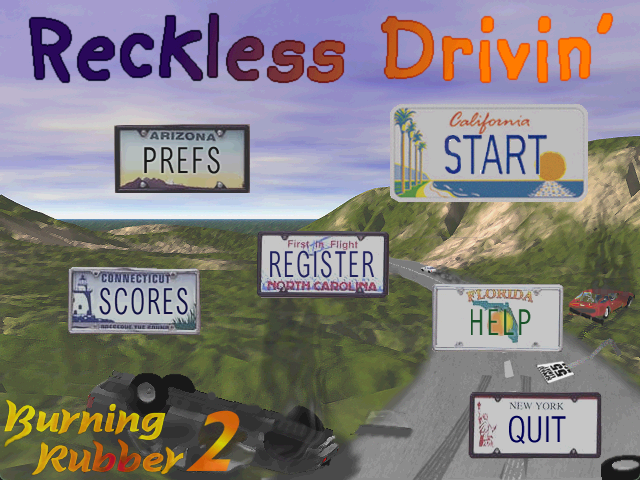
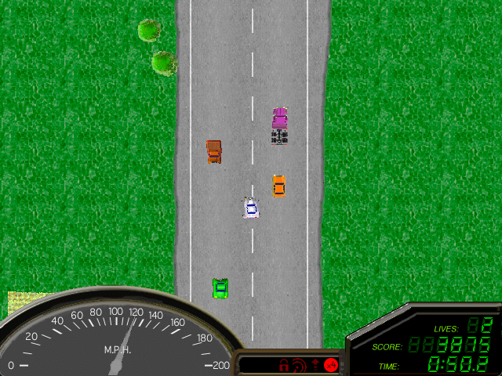
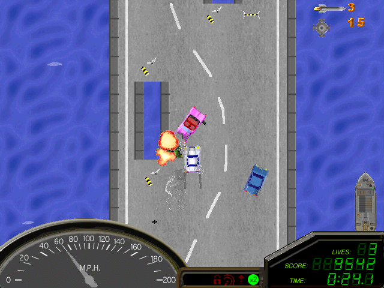
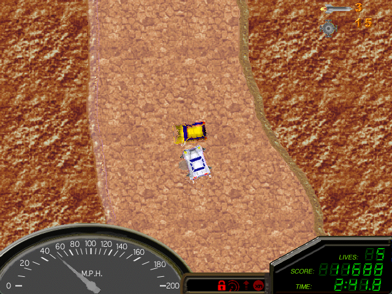

# Reckless Drivin' Reversed

A cross-platform SDL2/OpenGL port of **Reckless Drivin'**, the classic Mac OS racing game originally released in 2000 by Jonas Echterhoff.

The original game was built for older Macs and relied on APIs and features of the operating system that no longer exist. This port replaces all platform-specific code with SDL2 and OpenGL while preserving the original game logic, physics, and software renderer. The main liberty taken with this porting of Reckless Drivin' was the removal of the registration system. There is no need to register, the registration is baked into the game. All 10 levels are available and playable immediately. Also since this version is cross platform I have Prebuilt releases for Mac and Windows. Linux builds should be able to be built from source without too much trouble though I have not tried to build for Linux yet.



## Download

Pre-built binaries for Windows and macOS are available on the [Releases page](https://github.com/baileysostek/RecklessDrivinReverse/releases/tag/1.0).

These builds are not code-signed, so your operating system may show a warning when you first run the game. This is normal for open-source software distributed outside of app stores.

**Windows:** You may see a "Windows protected your PC" SmartScreen dialog. Click **More info**, then click **Run anyway**.

**macOS:** You may see a message that the app "can't be opened because Apple cannot check it for malicious software." To open it, right-click (or Control-click) on `RecklessDrivin.app` and select **Open**, then click **Open** in the confirmation dialog. You only need to do this once.

## Support This Project

This port is free and always will be, just like Jonas's original vision. This port took countless hours of reverse-engineering, debugging, and platform compatibility work to bring Reckless Drivin' to modern systems. If you'd like to support continued development and maintenance, [consider buying me a coffee](https://ko-fi.com/baileysostek)—every bit helps keep projects like this alive!


## Credits and Recognition

- **[Jonas Echterhoff](https://github.com/jechter)** — Original author of Reckless Drivin' (~2000). The original source code was released under the MIT License at [jechter/RecklessDrivin](https://github.com/jechter/RecklessDrivin).
- **[Nathan Craddock](https://github.com/natecraddock)** — His work on [open-reckless-drivin](https://github.com/natecraddock/open-reckless-drivin) provided the LZRW3-A decompression implementation and PPic image extraction that this port builds upon.

## Screenshots







## Controls

| Action       | Key              |
|-------------|------------------|
| Accelerate  | Up Arrow         |
| Brake       | Down Arrow       |
| Steer Left  | Left Arrow       |
| Steer Right | Right Arrow      |
| Kickdown    | Left Shift       |
| Handbrake   | Space            |
| Fire        | Z                |
| Missile     | X                |
| Pause       | P                |
| Quit        | Escape           |

Gamepad input is also supported if an SDL-compatible controller is connected.

## Building from Source

### Windows

Run the build script from the project directory:

```
build-win.bat
```

This will:
- Download SDL2 source if not already present
- Configure and build a Release build
- Extract game resources from the `Data` file
- Package the game into a `dist/` folder ready to run

For a Debug build with console output:

```
build-win-debug.bat
```

### macOS

```bash
chmod +x build-mac.sh
./build-mac.sh
```

This will build and bundle a signed `RecklessDrivin.app` in `build-mac/`.

### Manual Build

If you prefer to build manually:

```bash
cmake -S . -B build -DCMAKE_BUILD_TYPE=Release
cmake --build build --config Release
cmake --build build --target extract_resources
```

#### Prerequisites

- **CMake** 3.16 or later
- **C99 compiler** (MSVC, GCC, or Clang)
- **OpenGL** (system-provided)
- **SDL2** source — the build scripts download this automatically, or you can place SDL2 source in `./SDL2/`

## Running

The `Data` file and `assets/` directory must be in the working directory alongside the executable.

**Windows:** Run `dist/RecklessDrivin.exe` or `build/Debug/RecklessDrivin.exe` for debug builds.

**macOS:** Run `build-mac/RecklessDrivin.app`.

## Project Structure

```
RecklessDrivin/
  CMakeLists.txt          # Build configuration
  Data                    # Original Mac resource fork game data
  LICENSE                 # MIT License
  build-win.bat           # Windows release build script
  build-win-debug.bat     # Windows debug build script
  build-mac.sh            # macOS release build script
  app-icon.ico            # Windows executable icon
  RecklessDrivin.icns     # macOS app icon
  assets/                 # Extracted resources (generated by build)
  headers/                # Original game headers
  libs/lzrw/              # LZRW3-A decompression library
  platform/
    mac_compat.h/c        # Mac type definitions and Handle/Ptr emulation
    endian_compat.h       # Big-endian byte-swapping utilities
    platform_screen.h/c   # SDL2+OpenGL display (replaces DrawSprocket)
    platform_sound.h/c    # SDL2 audio mixer (replaces Sound Manager)
    platform_input.h/c    # SDL2 keyboard/gamepad input (replaces InputSprocket)
    platform_interface.c  # SDL2 menu system (replaces Mac toolbox UI)
    quickdraw.c           # QuickDraw PICT parser for menu/screen artwork
  source/                 # Original game logic (modified for portability)
  tools/
    res_extract.c         # Mac resource fork extractor
  .github/workflows/      # CI/CD build pipelines
```

## Architecture

The port preserves the original software renderer. All game rendering writes 16-bit (1-5-5-5 XRGB) pixels in big-endian format to a 640x480 framebuffer. At display time, `Blit2Screen()` converts the framebuffer to RGBA32, uploads it to an OpenGL texture, and draws a fullscreen quad. The window is resizable with 4:3 aspect ratio letterboxing.

## Additions / Changes

1. **Registration system removed.** Similar to the original shareware game, this game is designed to be shared, played and enjoyed. Jonas Echterhoff released a free registration code for the original game many years ago, so this modern implementation will be just as free as that existing version of the game. The registration code has been baked into the game by default, there is no need to register anymore. The register button has been disabled, and does nothing when clicked.
2. **High score name entry.** Players can type their name when achieving a high score, with scores displayed on the high scores screen. This ability was in the original game, but the specific implementation to show the list of scores and prompt a user to enter their name has been changed to use font rendering capabilities of SDL2. The spirit is the same, the look and feel are a little different.


## Credits and Recognition

- **[Jonas Echterhoff](https://github.com/jechter)** — Original author of Reckless Drivin' (~2000). The original source code was released under the MIT License at [jechter/RecklessDrivin](https://github.com/jechter/RecklessDrivin).
- **[Nathan Craddock](https://github.com/natecraddock)** — His work on [open-reckless-drivin](https://github.com/natecraddock/open-reckless-drivin) provided the LZRW3-A decompression implementation and PPic image extraction that this port builds upon.

## License

MIT License - Copyright (c) 2000 Jonas Echterhoff (original game), Copyright (c) 2026 Bailey Sostek (SDL2 port). See [LICENSE](LICENSE) for details.
